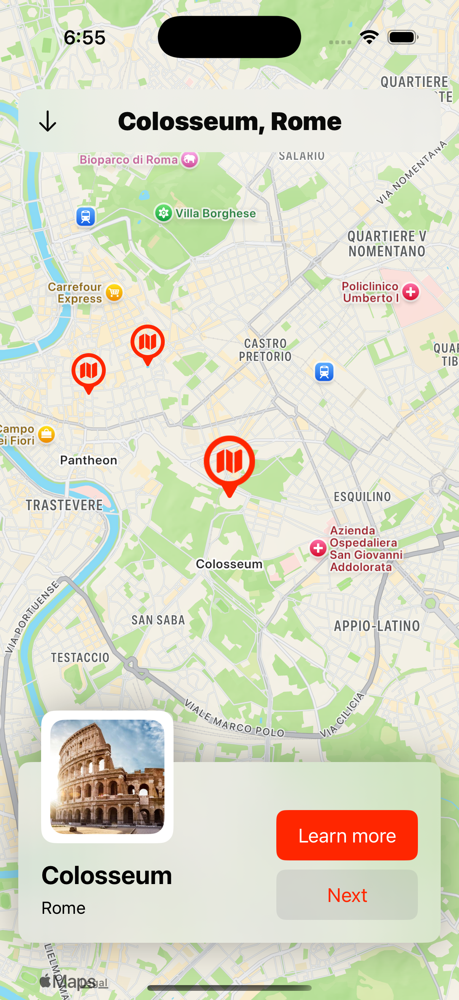
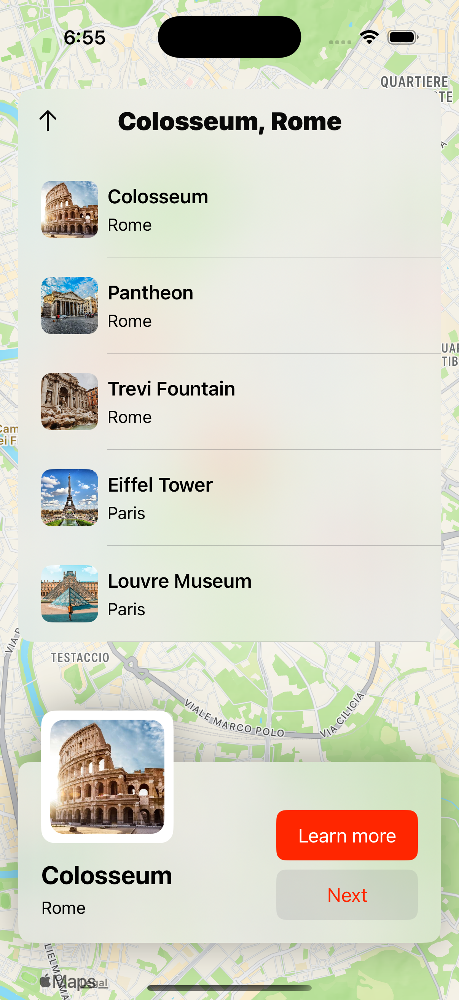
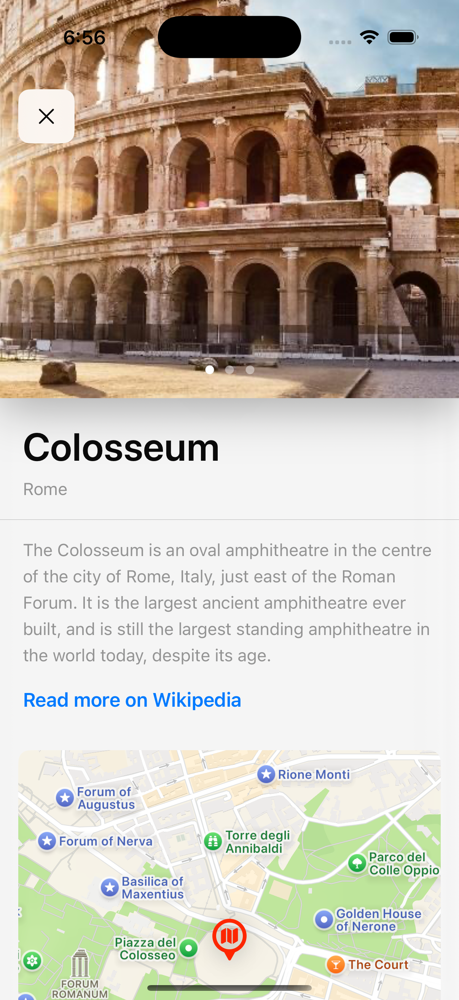

# 🌍 MapScene

**MapScene** is a SwiftUI-powered iOS app that lets users explore iconic global landmarks right on the map. With smooth navigation, dynamic location previews, and rich detail screens, MapScene makes learning about famous places easy and visually engaging.

---

## 📱 Features

- 🗺️ **Interactive Map** showing all pre-stored landmarks as location pins  
- 📍 **Location Picker** at the top to instantly jump to a specific location (e.g., Eiffel Tower)  
- 📌 **Location Preview Panel** at the bottom with:
  - **"Learn More"** button: Opens a detailed view with description, images, map, and Wikipedia link  
  - **"Next"** button: Automatically navigates to the next location  
- 💡 **Detail View** includes:
  - Multiple landmark images
  - Full description of the location
  - Embedded mini map centered on the location
  - Wikipedia integration via external link  
- ✨ Smooth animations and transitions throughout

---

## 🛠️ Built With

- **Swift** 🧠
- **SwiftUI** 🖌️
- **MapKit** for interactive maps
- **MVVM** architecture for clean code and scalability

---

## 📸 Screenshots

<table>
  <tr>
    <td align="center">
      <strong>Home Screen</strong> 
      
    </td>
  </tr>
  <tr>
    <td align="center">
      <strong>Location List Screen</strong> 
      
    </td>
    <td align="center">
      <strong>Details Screen</strong> 
      
    </td>
  </tr>
</table>
